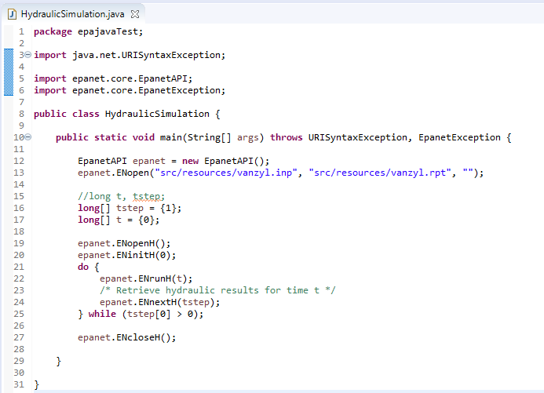

# EpaJava

EpaJava a coupling structure that allows calls from Java to the EPAToolkit dynamic link library of EPANET. It was implemented through the Java Native Access library (JNA), allowing dynamic and native invocations of the EPAToolkit. A set of classes were developed in the library to represent the hydraulic components involved in the modeling of WDN (e.g., pipes, pumps, reservoirs).
A convenient feature of using the JNA is the native calling to each of the available methods in EPANET for any of the implemented classes without any modifications concerning the original EPAToolkit library. Therefore, users already familiar with EPAToolkit should be able to accurately represent a network in the coupling library. In practical terms, the library loads the water network characteristics through an EPANET input file (.inp), in which the operational variables are dynamically modified according to the optimization procedure.

## Comenzando 🚀

Las siguientes instrucciones te permitirán obtener una copia del proyecto en funcionamiento en tu máquina local para propósitos de desarrollo y pruebas.

### Pre-requisitos 📋

- Sistema Operativo Windows 10.
- JDK Java 8: [Ver guía de instalación](tutorial/JDK-Java-8.md).
- Entorno de desarrollo Eclipse: [Ver guía de instalación](tutorial/Eclipse.md).

### Descarga del Proyecto ⬇️

1. Para descargar puede ir al link como se muestra en la Figura 1 o directamente haciendo clic [aquí](https://github.com/jhawanet/epajava/archive/master.zip).

|  | 
|:--:|
| *Figura 1* |

2. Se descarga un archivo comprimido en formato ZIP, por lo que es necesario descomprimir para acceder a su contenido, para ello debe seguir los pasos indicados en las Figuras 2 y 3.

|  | 
|:--:|
| *Figura 2* |

|  | 
|:--:|
| *Figura 3* |

### Integracion en un proyecto JAVA 🔧

Para los siguientes pasos se utilizara el programa Eclipse:

3. Creamos un proyecto nuevo como se ve en las Figuras 4 y 5:

|  | 
|:--:|
| *Figura 4* |

|  | 
|:--:|
| *Figura 5* |

4. Se debe agregar la dependencia al proyecto descargado, para ello es necesario configurar la opción **Configure Build Path...**

|  | 
|:--:|
| *Figura 5* |

5. Una vez abierta la ventana se debe seleccionar la pestaña **Libraries**

|  | 
|:--:|
| *Figura 6* |

6. Después, se debe seleccionar el botón **Add External JARs...**

|  | 
|:--:|
| *Figura 7* |

7. Aquí debemos buscar la carpeta donde quedó almacenado el proyecto epajava y seleccionar el archivo **epajava.jar**

|  | 
|:--:|
| *Figura 8* |

8. Y finalmente seleccionamos el botón **Apply and Close**

|  | 
|:--:|
| *Figura 9* |

## Ejecutando las pruebas ⚙️

Para realizar una prueba, crearemos un paquete que nos servira para almacenar la información de las redes (archivos .inp) 

9. Hacer clic derecho sobre la carpeta **src** y seleccionar la opción **New** > **Package**

|  | 
|:--:|
| *Figura 11* |

10. En este caso al paquete lo nombraremos **resources** y ahí guardaremos el archivo .inp que utilizaremos.

|  | 
|:--:|
| *Figura 12* |

Después creamos una clase que tendra nuestro código de prueba

11. Hacer clic derecho sobre la carpeta **src** y seleccionar la opción **New** > **Class**

|  | 
|:--:|
| *Figura 13* |

12. Una vez dentro se debe indicar un nombre a la clase, en este caso llamamos **HydraulicSimulation**

|  | 
|:--:|
| *Figura 14* |

13. Dentro de la clase creada se debe copiar y pegar el siguiente código

```java
import java.net.URISyntaxException;

import epanet.core.EpanetAPI;
import epanet.core.EpanetException;

public class HydraulicSimulation {

	public static void main(String[] args) throws URISyntaxException, EpanetException {
		
		EpanetAPI epanet = new EpanetAPI();
		epanet.ENopen("src/resources/vanzyl.inp", "src/resources/vanzyl.rpt", "");
		
		//long t, tstep;
		long[] tstep = {1};
		long[] t = {0};
		
		epanet.ENopenH();
		epanet.ENinitH(0);
		do {  
			epanet.ENrunH(t);  
			/* Retrieve hydraulic results for time t */
			epanet.ENnextH(tstep);  
		} while (tstep[0] > 0);  
		
		epanet.ENcloseH();

	}

}
```

Desde Eclipse debe verse de la siguiente forma:

|  | 
|:--:|
| *Figura 5* |

14. Finalmente para ejecutar debemos ir al Menú de Eclipse y seleccionar la pestaña **Run** y la primera opción **Run**.

|  | 
|:--:|
| *Figura 6* |

## Licencia 📄

Este proyecto está bajo la Licencia (MIT) - mira el archivo [LICENSE.md](LICENSE.md) para detalles
