# EpaJava

EpaJava a coupling structure that allows calls from Java to the EPANET Programmer's Toolkit (EPAToolkit) dynamic link library of EPANET. It was implemented through the Java Native Access library (JNA), allowing dynamic and native invocations of the EPAToolkit. A set of classes were developed in the library to represent the hydraulic components involved in the modeling of WDN (e.g., pipes, pumps, reservoirs).

A convenient feature of using the JNA is the native calling to each of the available methods in EPANET for any of the implemented classes without any modifications concerning the original EPAToolkit library. Therefore, users already familiar with EPAToolkit should be able to accurately represent a network in the coupling library. In practical terms, the library loads the water network characteristics through an EPANET input file (.inp), in which the operational variables are dynamically modified according to the optimization procedure.

## Getting Started 🚀

The following instructions will allow you to obtain a copy of the EpaJava in an operational way for development and testing purposes.

### Requirements 📋

- Windows 10.
- JDK Java 8: [Installation Guide](tutorial/JDK-Java-8.md).
- Eclipse IDE: [Installation Guide](tutorial/Eclipse.md).

### Project Download ⬇️

1. To download, you can go to the link as shown in Figure 1 or going directly clicking [here](https://github.com/jhawanet/epajava/archive/master.zip).

| 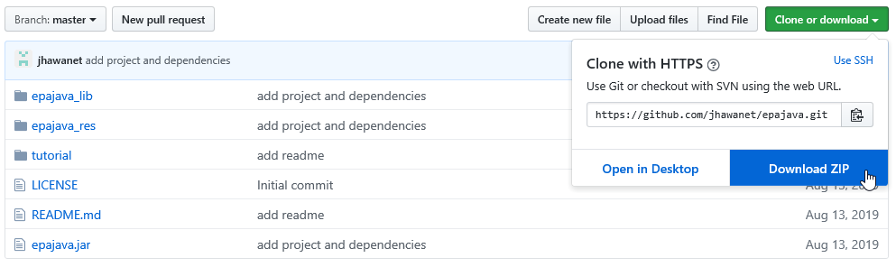 | 
|:--:|
| *Figure 1* |

2. Unzip the file to access its content, following the steps indicated in figures 2 and 3.

| 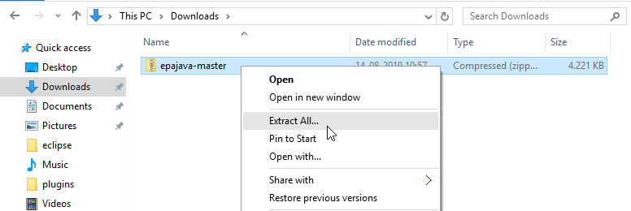 | 
|:--:|
| *Figure 2* |

| 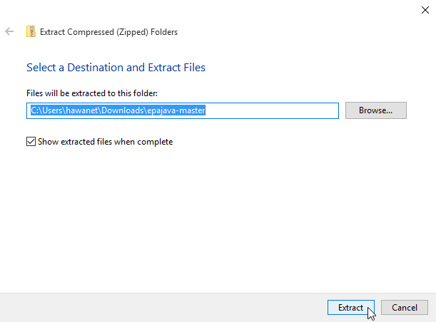 | 
|:--:|
| *Figure 3* |

### Integration to a Java Project in Eclipse 🔧

3. Create a new Java Project, as seen in figures 4 and 5:

| 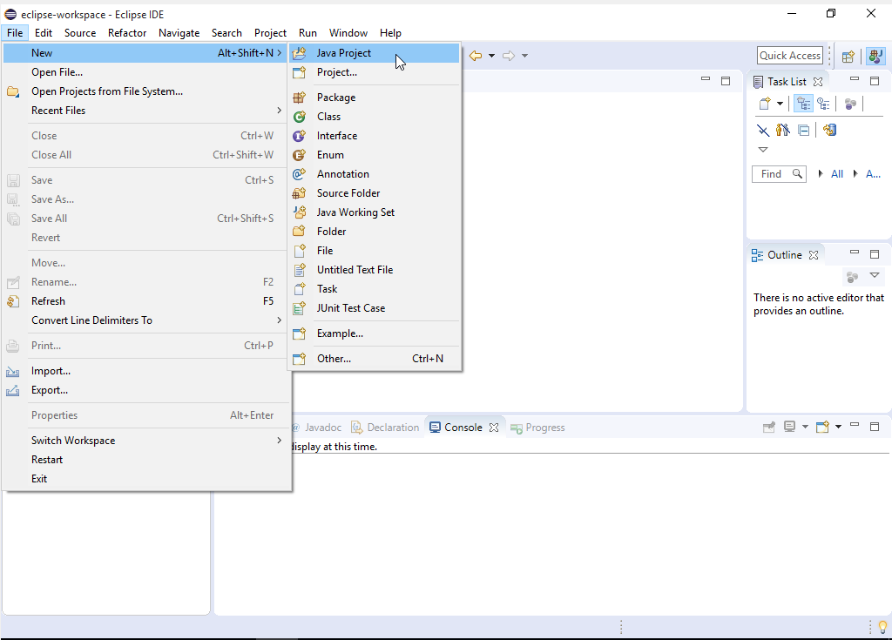 | 
|:--:|
| *Figure 4* |

| 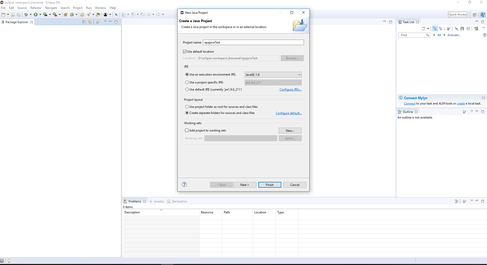 | 
|:--:|
| *Figure 5* |

4. Add the dependency to the created project, for this, it is necessary to configure the **Configure Build Path** option, figure 6.

|  | 
|:--:|
| *Figure 6* |

5. Open the window and select the **Libraries** tab, figure 7.

| 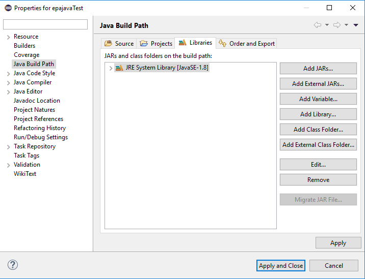 | 
|:--:|
| *Figure 7* |

6. Select the **Add External JARs** button, figure 8.

| 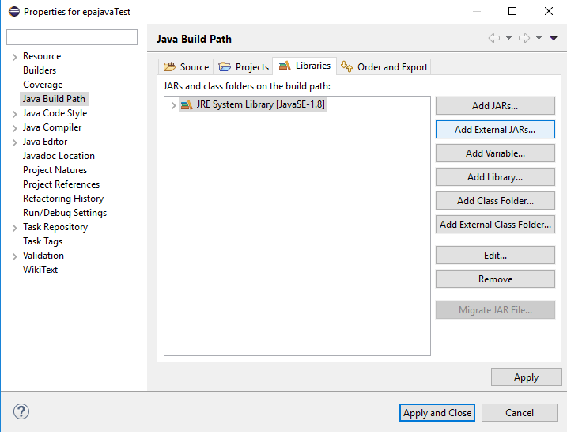 | 
|:--:|
| *Figure 8* |

7. Select the folder where the EpaJava project was stored and select the **epajava.jar** file, figure 9.

| 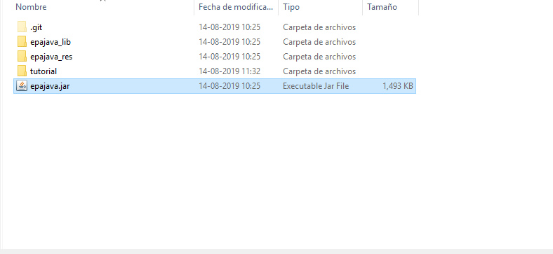 | 
|:--:|
| *Figure 9* |

8. Finally, select the **Apply and Close** button, figure 10.

|  | 
|:--:|
| *Figure 10* |

## Testing ⚙️

To perform a test, create a new package to store the networks' information (.inp files).

9. Right-click on the **src** folder and select the option **New** > **Package**, figure 11.

| 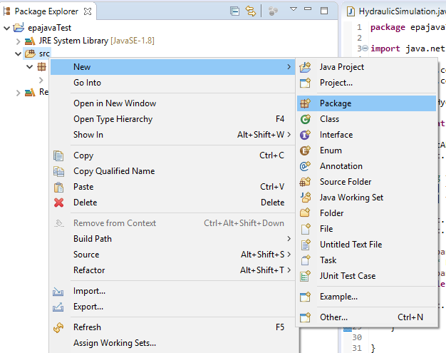 | 
|:--:|
| *Figure 11* |

10. Name the package as **resources** or another name of your choice. Save the .inp file that we will use, then create a class for the test code, figure 12.

| 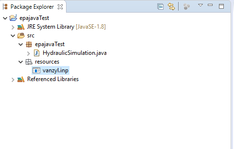 | 
|:--:|
| *Figure 12* |

11. Right-click on the **src** folder and select the option **New** > **Class**, figure 13.

| 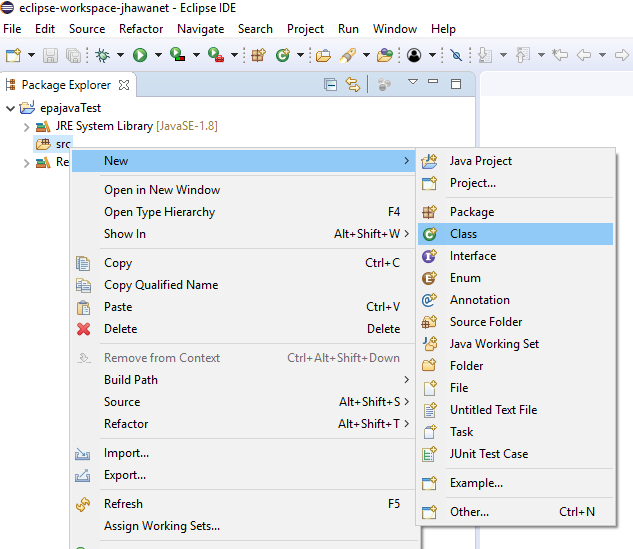 | 
|:--:|
| *Figure 13* |

12. Indicate a name to the class, in this case, we call it **HydraulicSimulation**, figure 14.

| 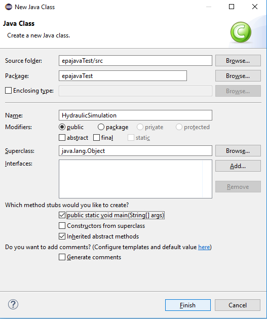 | 
|:--:|
| *Figure 14* |

13.	Within the created class, copy and paste the following code.

```java
import java.net.URISyntaxException;

import epanet.core.EpanetAPI;
import epanet.core.EpanetException;

public class HydraulicSimulation {

	public static void main(String[] args) throws URISyntaxException, EpanetException {
		
		EpanetAPI epanet = new EpanetAPI();
		epanet.ENopen("src/resources/vanzyl.inp", "src/resources/vanzyl.rpt", "");
		
		//long t, tstep;
		long[] tstep = {1};
		long[] t = {0};
		
		epanet.ENopenH();
		epanet.ENinitH(0);
		do {  
			epanet.ENrunH(t);  
			/* Retrieve hydraulic results for time t */
			epanet.ENnextH(tstep);  
		} while (tstep[0] > 0);  
		
		epanet.ENcloseH();

	}

}
```

14. Finally, to run the experiment select the Run tab in the Eclipse menu, and click the first **Run** option, figure 15.

| 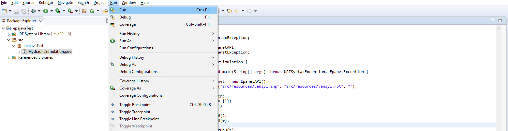 | 
|:--:|
| *Figure 15* |

## License 📄

This project is under the MIT License. See the [LICENSE](LICENSE.md) file for the full license text.