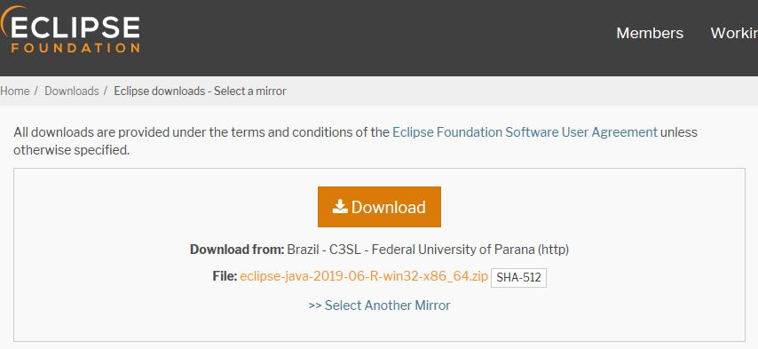
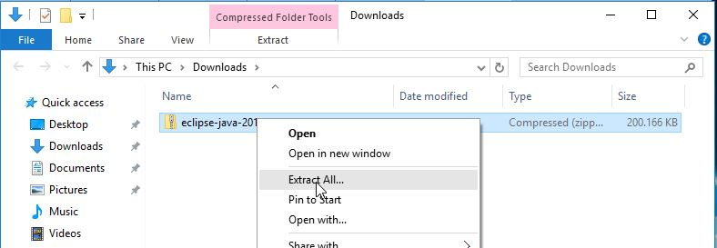
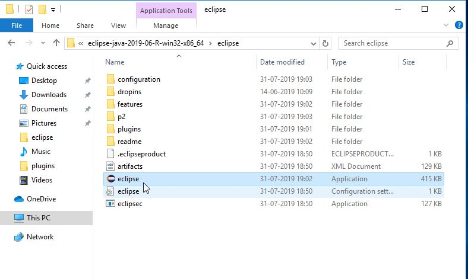

# Guía de instalación: Eclipse

## Pre-requisitos

- Tener instalado JDK Java 8

## Descarga

1. Ir a la siguiente página https://www.eclipse.org/downloads/download.php?file=/technology/epp/downloads/release/2019-06/R/eclipse-jee-2019-06-R-win32-x86_64.zip y seleccionar el botón **Descarga** como muestra la Figura 1.

|  | 
|:--:|
| *Figura 1* |

## Instalación

> Nota: Eclipse no se instala como un programa "normal" de Windows, solo basta con descargar el archivo, descomprimir y queda disponible para ser ejecutado.

2. Hacer clic derecho sobre el archivo descargado y seleccionar **Extraer todo**, para así descomprimir el contenido del archivo.

|  | 
|:--:|
| *Figura 2* |

3. Una vez finalizada la extracción se puede a ingresar la carpeta y ejecutar haciendo doble clic sobre el programa como se muestra en la Figura 3.

|  | 
|:--:|
| *Figura 3* |