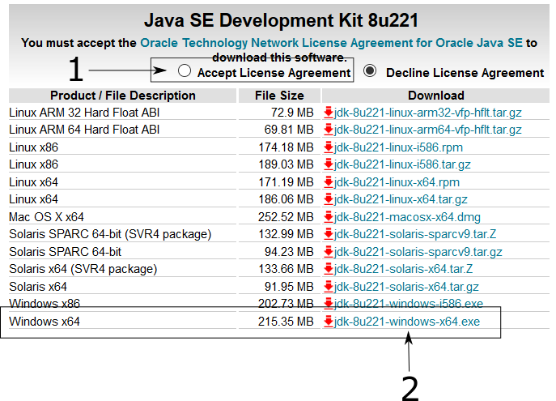
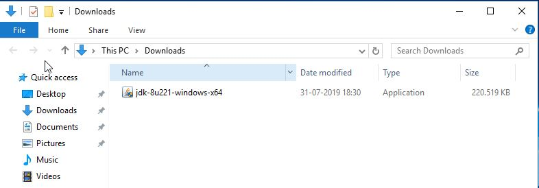
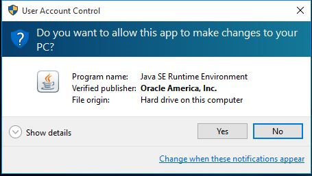
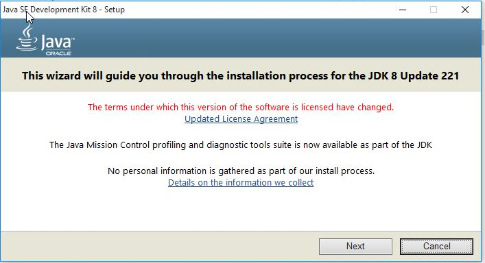
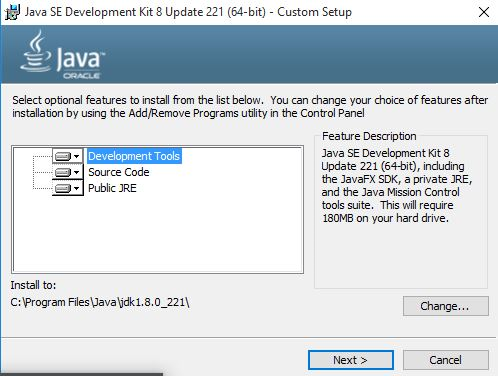
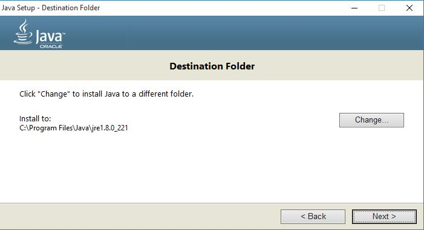
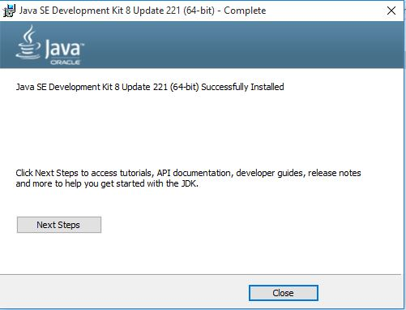

# Installation Guide: JDK Java 8

The following instructions will let you to install **JDK Java 8** on your computer. If you currently have an account with other **JDK** version, do not worry about it.

## Download

1. Go to https://www.oracle.com/technetwork/java/javase/downloads/jdk8-downloads-2133151.html
2. Accept license agreement. See Figure 1, step **1**.
3. Select the hyperlink ***jdk-8u221-windows-x64.exe***. See Figure 1, step **2**.

|  | 
|:--:|
| *Figure 1* |

4. Finally, to end the download, Oracle is going to ask you to create an account on its website.

|  | 
|:--:|
| *Figure 2* |

### Installation

5. Double-click on the downloaded archive.

|  | 
|:--:|
| *Figure 3* |

6. Commonly, Windows 10 ask if you want to run the archive. Select **Yes**.

|  | 
|:--:|
| *Figure 4* |

7. To install, you have to select **next** as shown in figures 4, 5 and 6:

|  | 
|:--:|
| *Figure 5* |

|  | 
|:--:|
| *Figure 6* |

|  | 
|:--:|
| *Figure 7* |

8. Finally, once the download is done, it will be shown the following message.

|  | 
|:--:|
| *Figure 8* |